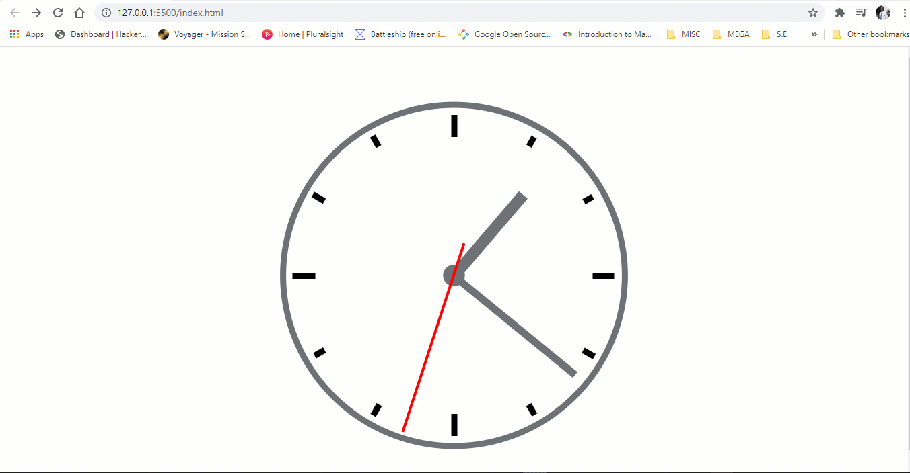

# Analogue Clock

A javascript, html, css and svg based analogue clock that can be stylized and added to any project.

It syncs with the system clock every second, so javascript throttling will not affect time accuracy.

# Demo

